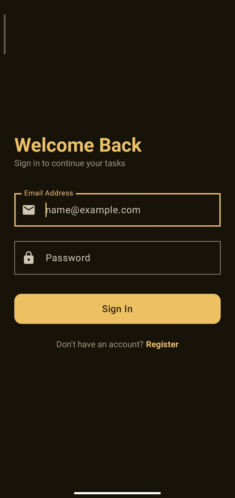
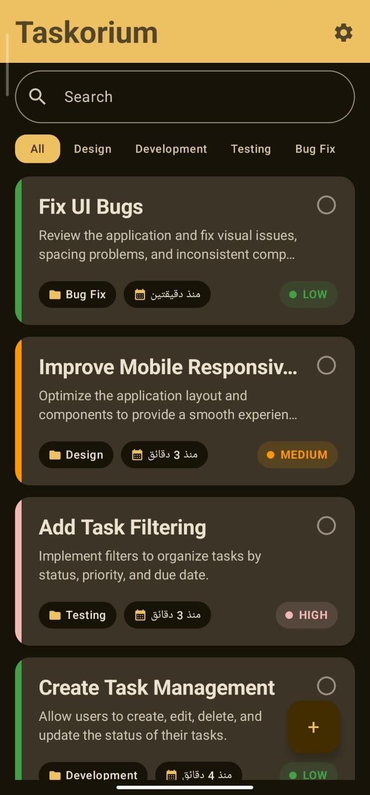
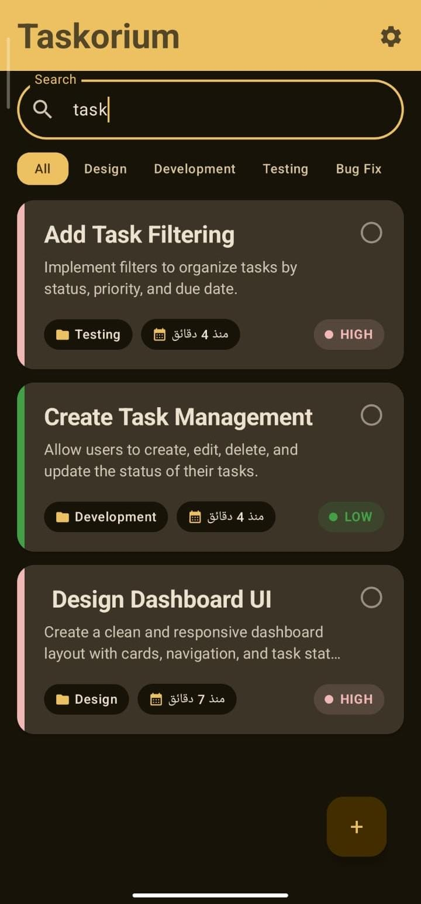
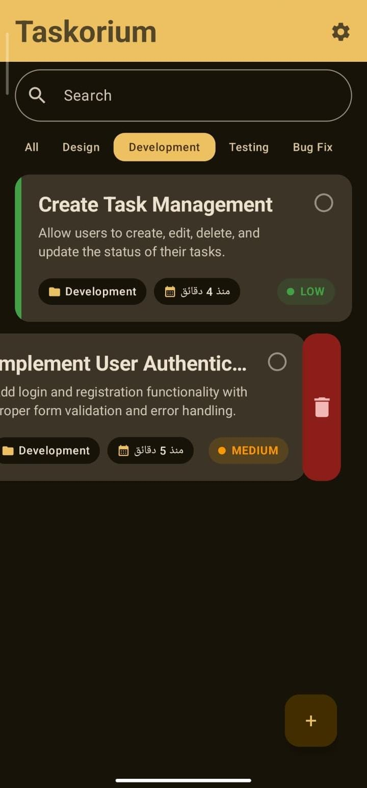
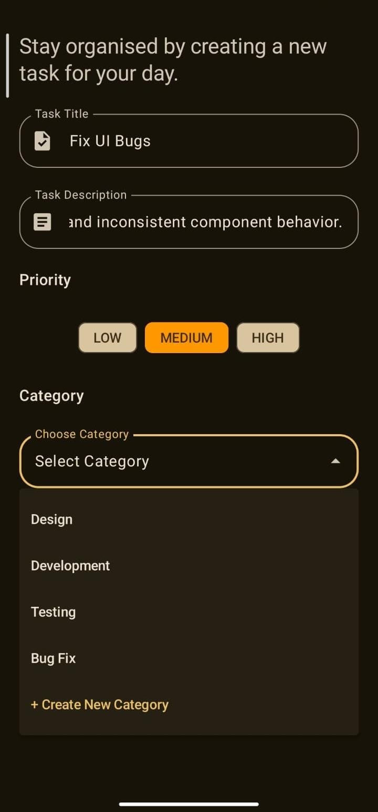
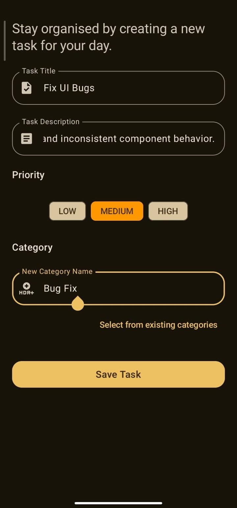

# Taskorium

A modern Android task management application built with Kotlin and Jetpack Compose.

> A personal Android project focused on modern Android architecture, local persistence, REST API integration, authentication, data synchronization, and background work.

## Features

* Create, update, and delete tasks
* Organize tasks by categories
* Search and filter tasks
* User authentication
* Local persistence with Room
* REST API integration and data synchronization
* Offline/local data handling
* Background synchronization with WorkManager
* Task reminders and notifications
* Soft deletion
* Reactive UI state management with StateFlow and SharedFlow

## Screenshots

<p align="center">
  
  
  
</p>

<p align="center">
  
  
  
</p>

## Tech Stack

### Language & UI

* Kotlin
* Jetpack Compose
* Material 3

### Architecture

* MVVM
* Layered Architecture
* Repository Pattern
* Dependency Injection with Hilt

### Android

* ViewModel
* Navigation Compose
* Coroutines
* Flow
* WorkManager
* Notifications
* AlarmManager

### Local Data

* Room
* DataStore

### Networking

* Retrofit
* OkHttp
* REST APIs
* Supabase REST

### Authentication

* Access and refresh token handling
* TokenAuthenticator

### Data Modeling

* DTOs
* Entities
* Domain Models
* Mappers

## Architecture

Taskorium uses a layered architecture with MVVM to separate UI, presentation, domain contracts, and data responsibilities.

```text
Jetpack Compose UI
        ↓
    ViewModel
        ↓
    Repository
     ↙     ↘
   Room   REST API
            ↓
         Supabase
```

The application uses `StateFlow` for observable UI state and `SharedFlow` for one-time UI events. Repository implementations coordinate local persistence and remote API operations.

## Project Structure

```text
app/
└── src/main/java/com/example/taskorium/
    ├── core/
    │   ├── alarm/
    │   ├── session/
    │   └── util/
    │
    ├── data/
    │   ├── local/
    │   ├── remote/
    │   ├── repository/
    │   └── sync/
    │
    ├── di/
    │
    ├── domain/
    │   ├── alarm/
    │   ├── model/
    │   └── repository/
    │
    ├── route/
    │
    ├── ui/
    │   ├── composable/
    │   ├── features/
    │   ├── theme/
    │   └── uiComponents/
    │
    ├── MainActivity.kt
    └── TaskoriumApplication.kt
```

## Technical Highlights

* Implemented local persistence using Room with DAOs, entities, and type converters.
* Integrated REST APIs using Retrofit and OkHttp.
* Implemented authentication using access and refresh tokens.
* Added token refresh handling through a custom `TokenAuthenticator`.
* Separated API DTOs, local entities, and domain models using dedicated mappers.
* Implemented local and remote synchronization using WorkManager.
* Used `StateFlow` for observable UI state and `SharedFlow` for one-time UI events.
* Implemented task reminders using `AlarmManager` and Android notifications.
* Structured UI features using dedicated screens, routes, ViewModels, UI state, and UI events.
* Used Hilt for dependency injection.

## Setup & Configuration

### Requirements

* Android Studio
* JDK compatible with the project's Gradle configuration
* Android SDK
* A Supabase project configured for the application's backend

### Configuration

The project uses local configuration values for environment-specific settings such as the Supabase URL and API key.

Create or update `local.properties` in the project root:

```properties
SUPABASE_URL=your_supabase_url
SUPABASE_ANON_KEY=your_supabase_anon_key
```

> `local.properties` is intentionally excluded from version control and should not be committed to the repository.

### Running the Project

1. Clone the repository.
2. Open the project in Android Studio.
3. Configure the required values in `local.properties`.
4. Sync the Gradle project.
5. Build and run the application on an Android device or emulator.

## Project Status

Taskorium is a personal Android project developed to practice and demonstrate modern Android development, architecture, networking, persistence, authentication, synchronization, and background processing.

It is not presented as a production or commercial application.
